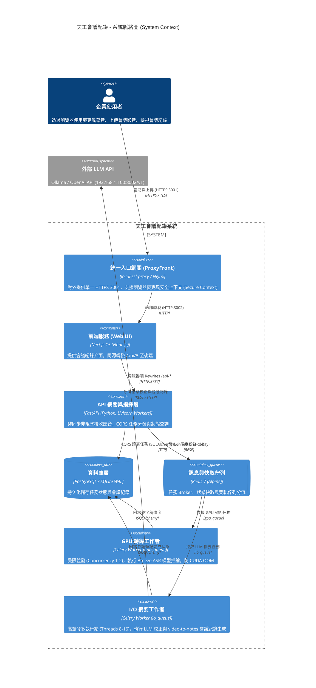
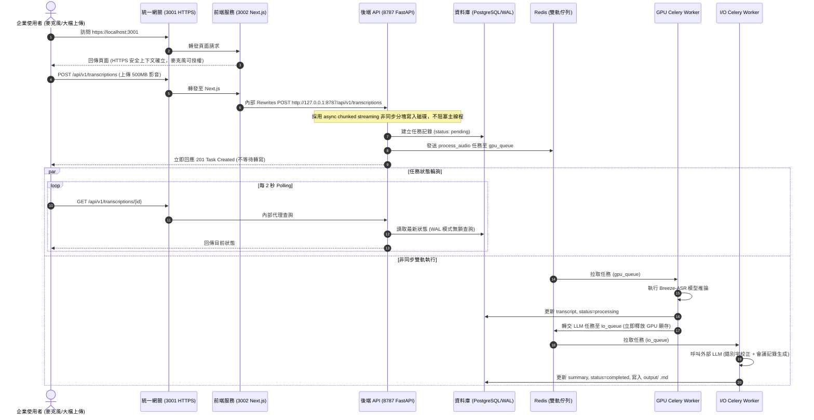

# 系統設計規格書 (System Design Document - SDD.md)
## 天工會議紀錄：企業級高併發服務架構與端點重整設計

---

## 1. 系統概述與架構選型 (Architecture Overview)

本系統為企業級語音/視訊會議轉錄與 AI 智導會議記錄平台。針對企業多用戶高併發 (High Concurrency) 情境下同時進來的影音上傳、任務狀態輪詢、重新摘要生成等請求，本系統遵循 **Clean Architecture**、**S.O.L.I.D 原則** 以及 **CQRS (Command Query Responsibility Segregation)** 理念進行微服務層級的設計與重整。

### 1.1 系統架構脈絡圖 (System Context Diagram)



---

## 2. CQRS 與高併發分流設計 (CQRS & Queue Segregation)

為了解決多請求同時進來時的計算阻塞與 GPU 資源枯竭問題，系統在架構上落實 CQRS 與佇列分流：

```mermaid
graph TD
    subgraph Client [客戶端併發請求]
        CmdUpload["Command: 上傳影音建立任務 (POST /transcriptions)"]
        CmdResummarize["Command: 重新生成會議紀錄 (POST /resummarize)"]
        QueryStatus["Query: 輪詢任務狀態 (GET /transcriptions/{id})"]
        QueryAudio["Query: 串流播放音訊 (GET /transcriptions/{id}/audio)"]
    end

    subgraph APILayer [FastAPI 網關層 (非同步非阻塞)]
        AsyncHandler["Async Chunked Upload Handler (非同步串流磁碟寫入)"]
        QueryHandler["Fast Read Handler (直接查詢 DB 或 Redis 快取)"]
    end

    subgraph QueueLayer [Redis 雙軌佇列分流]
        GPUQ["[gpu_queue] ASR 轉寫 (嚴格限流 Concurrency=1-2, Prefetch=1, 防 OOM)"]
        IOQ["[io_queue] LLM 校正/會議筆記 (多執行緒池 Concurrency=8-16)"]
    end

    subgraph Storage [資料儲存]
        DB[(PostgreSQL / SQLite WAL 讀寫分離)]
    end

    CmdUpload --> AsyncHandler
    CmdResummarize --> AsyncHandler
    QueryStatus --> QueryHandler
    QueryAudio --> QueryHandler

    AsyncHandler --> DB
    AsyncHandler -->|發布音訊轉寫| GPUQ
    AsyncHandler -->|發布重新摘要| IOQ
    QueryHandler -->|只讀不鎖定| DB

    GPUQ -->|ASR 完成後觸發| IOQ
```

---

## 3. 端點合併與 HTTPS 錄音安全上下文設計

### 3.1 端點合併對比

1. **舊架構**：
   - 3001 (ProxyFront HTTPS) -> 3002 (Next.js)
   - 8788 (ProxyBack HTTPS) -> 8787 (FastAPI)
   - 缺陷：使用者造訪 3001 錄音後，瀏覽器發送跨域請求至 8788，遭遇雙自簽證書阻擋 (`ERR_CERT_AUTHORITY_INVALID`) 與 Mixed Content 警告。開啟 5 個 Terminal 視窗，管理混亂。
2. **新重整架構**：
   - **唯一對外 HTTPS 端點**：`https://localhost:3001`。
   - **完全保障錄音設備存取**：前端頁面運行在 3001 HTTPS 下，`navigator.mediaDevices.getUserMedia` 完美獲取授權。
   - **同源代理**：前端發送相對路徑 `/api/v1/...`，進入 3001 後由 Next.js 伺服器端內網轉發給 `8787`。
   - **效益**：淘汰 8788，使用者只需信任 1 次憑證，終端機精簡，傳輸無跨域額外開銷。

### 3.2 呼叫序列圖 (Sequence Diagram)



---

## 4. 服務標準作業程序 (SOP Generation Protocol)

### 4.1 服務編排與啟動 SOP (Service Startup SOP)

```yaml
parameters:
  inputs:
    - name: REDIS_URL
      type: string
      default: "redis://localhost:6379/0"
      description: "Redis 佇列 Broker 連線字串"
    - name: DATABASE_URL
      type: string
      optional: true
      default: "sqlite:///./transcriptions.db"
      description: "資料庫連線字串 (支援 PostgreSQL 與 SQLite WAL)"
    - name: WORKERS_COUNT
      type: integer
      default: 2
      description: "FastAPI Uvicorn 並發工作進程數量"
  outputs:
    - name: FRONTEND_HTTPS_URL
      type: string
      value: "https://localhost:3001"
      description: "提供使用者訪問與麥克風存取之主要端點"
    - name: BACKEND_DOCS_URL
      type: string
      value: "http://localhost:8787/docs"
      description: "後端內部 API 規格說明端點"
  constraints:
    - "作業系統必須為 Windows 11"
    - "前端麥克風錄音必須在 Secure Context (HTTPS 3001) 下運行"
    - "GPU 佇列 Concurrency 嚴格限制為 1-2，禁止超過系統 GPU VRAM 承受限度"
```

#### Steps (核心步驟流程)
1. 啟動腳本 **MUST** 先行執行連接埠佔用掃描，若偵測到 `3001`、`3002`、`8787` 存在殘留或孤兒進程，**MUST** 自動安全釋放該端口。
2. 系統 **MUST** 先行啟動 Redis 容器或本機服務，並 **MUST** 透過連線探針輪詢確認收到 `PONG` 回應後，方可繼續後續步驟。
3. 系統 **MUST** 接續啟動 FastAPI 後端服務，並 **SHOULD** 使用多 Worker 模式 (`--workers 2`) 以提高高併發吞吐量，且在生產模式下 **MUST NOT** 啟用 `--reload`。
4. 系統 **MUST** 輪詢後端 `/docs` 端點確認 HTTP 200 就緒。
5. 系統 **MUST** 啟動 Celery 雙軌 Worker：
   - GPU Worker **MUST** 綁定 `gpu_queue`，並 **MUST** 設定 `concurrency=1` 與 `prefetch_multiplier=1`。
   - I/O Worker **MUST** 綁定 `io_queue`，並 **SHOULD** 採用多線程模式 (`--pool=threads -c 8`) 處理外部 LLM 呼叫。
6. 前端服務 **MUST** 在後端就緒後啟動，並透過 `concurrently` 同時啟動 `3001` 本地 SSL 代理。
7. 系統 **MUST NOT** 啟動廢棄的 `8788` 後端代理。

#### Error Handling (異常與邊界處理)

| 編號 | 異常情境 (Edge Case) | 觸發條件 (Criteria) | 對應行動 (Action) |
| :--- | :--- | :--- | :--- |
| **EC-01** | 連接埠被非本系統進程佔用 | 端口掃描發現佔用進程但無法透過常規 SIGTERM 終止 | 啟動腳本 **MUST** 提示衝突進程 PID，並嘗試強制終止 (`taskkill /F /PID`)；若失敗 **MUST** 中斷啟動並輸出指引訊息，**MUST NOT** 盲目啟動導致錯誤擴大。 |
| **EC-02** | Redis 逾時未啟動 | 輪詢 Redis 達 15 秒仍無 `PONG` 回應 | 系統 **MUST** 輸出 Redis 啟動失敗告警，提示使用者檢查 Docker 守護進程，並 **MUST** 中止 Celery 與後端啟動以防雪崩。 |
| **EC-03** | 多大檔案並發上傳磁碟空間不足 | 上傳時磁碟可用空間低於預估檔案大小 (例如 < 2GB) | 後端 API **MUST** 捕捉 `OSError: [Errno 28] No space left on device`，安全刪除部分寫入的暫存檔案，並 **MUST** 回傳 HTTP 507 Insufficient Storage，**MUST NOT** 造成進程無預警崩潰。 |
| **EC-04** | GPU ASR 模型遭遇 CUDA OOM | 轉寫超長音檔時 GPU 顯存不足拋出 `torch.cuda.OutOfMemoryError` | GPU Worker **MUST** 捕捉 OOM 例外，強制調用 `torch.cuda.empty_cache()` 與 `gc.collect()` 釋放顯存，將任務狀態標記為 `failed` 並記錄友善錯誤訊息，**MUST NOT** 導致 Worker 進程重啟或佇列卡死。 |

---

## 5. 資料庫並發存取設計 (Database Concurrency)

* **PostgreSQL 連線池設計**：
  - 採用 SQLAlchemy `QueuePool`。
  - `pool_size = 20`，`max_overflow = 10`，`pool_recycle = 1800`。
* **SQLite WAL 模式 (本地單機備援)**：
  - 若連線字串為 `sqlite:`，在連線事件監聽器中強制執行：
    ```sql
    PRAGMA journal_mode = WAL;
    PRAGMA busy_timeout = 30000;
    PRAGMA synchronous = NORMAL;
    ```
  - 此舉將讀寫鎖定徹底解耦，允許任意數量的讀取操作與單一寫入操作同時進行，徹底杜絕 `database is locked`。
