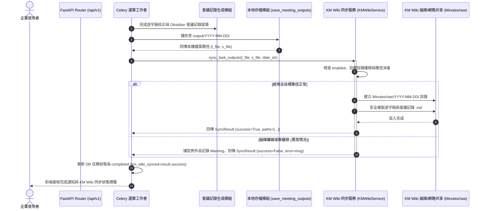

# 系統設計規格書 (System Design Document - SDD.md)
## 天工會議紀錄：KM Wiki Minutes 知識庫 raw 檔區自動同步與音視雙模態整合管線

---

## 1. 系統架構與選型 (Architecture & Tech Stack)

本系統為**企業級會議智能分析與知識庫自動化平台**。除了多模態語音辨識與投影片關鍵幀理解外，進一步擴充 **KM Wiki 自動同步服務**。當音訊或視訊會議完成轉錄校正與 Obsidian PKM 結構化會議筆記提煉後，系統會自動將「會議逐字稿 (`.md`)」與「會議紀錄 (`.md`)」同步發布至內部 KM Wiki 的 **Minutes 知識庫之 raw 檔區**（預設為 `D:/km_wiki/Minutes/raw`），以供企業知識庫索引引擎即時檢索與入庫。

### 1.1 系統脈絡與管線架構圖 (Context & Pipeline Architecture)

```mermaid
flowchart TD
    User([企業使用者 / Web / CLI]) --> Ingress["統一入口 (Web / Script)"]
    Ingress --> Process["轉錄與會議記錄處理核心 (ASR + LLM + VLM)"]
    
    subgraph OutputPipeline [持久化儲存管線]
        Process --> LocalArchive["1. 本地歸檔 (output/YYYY-MM-DD/)\n- [會議名稱]_逐字稿.md\n- [會議名稱]_會議紀錄與摘要.md"]
        LocalArchive --> KMWikiSync["2. KM Wiki 同步服務 (KMWikiService)"]
    end

    subgraph KMWikiStorage [KM Wiki 系統 / 知識庫架構]
        KMWikiSync --> KMConfig{"檢查 [KMWiki] enabled"}
        KMConfig -- true --> PathResolve["解析目標目錄 (raw_dir: D:/km_wiki/Minutes/raw)\n若 date_subfolder=true 則建立 YYYY-MM-DD 子目錄"]
        KMConfig -- false --> Skip["略過同步"]
        
        PathResolve --> Verify["檔案寫入與同名安全性檢查"]
        Verify --> RawStorage[("Minutes 知識庫 raw 檔區\n(Minutes/raw/YYYY-MM-DD/)")]
        RawStorage --> KMIndexer["KM 企業搜尋與知識庫索引器"]
    end

    subgraph RestAPI [Web 控制與管理 API (Controller)]
        KMWikiSync -.-> SyncStatus[("任務同步狀態紀錄 (TaskModel.km_wiki_synced)")]
        User --> ManualSync["POST /api/v1/transcriptions/{id}/sync-km-wiki"]
        ManualSync --> KMWikiSync
    end
```

### 1.2 KM Wiki 同步處理序列圖 (Sequence Diagram)



---

## 2. 流程標準作業規範 (SOP Generation Protocol - RFC2119)

### 2.1 parameters (YAML 屬性宣告)

```yaml
parameters:
  inputs:
    task_id:
      type: string (UUID)
      required: true
      description: "後端任務唯一識別代碼"
    transcript_file_path:
      type: string (FilePath)
      required: true
      description: "本機已生成之校正逐字稿 Markdown 檔案絕對路徑"
    summary_file_path:
      type: string (FilePath)
      required: true
      description: "本機已生成之 Obsidian PKM 會議記錄 Markdown 檔案絕對路徑"
    meeting_title:
      type: string
      required: false
      description: "消毒後之會議主題名稱"
    meeting_date:
      type: string (YYYY-MM-DD)
      required: false
      description: "會議日期，若無則預設當前日期"
  outputs:
    km_wiki_synced:
      type: boolean
      description: "是否成功同步至 KM Wiki Minutes 知識庫 raw 檔區"
    synced_files:
      type: list of string
      description: "成功寫入 KM Wiki raw 檔區之目標檔案完整路徑清單"
    error_message:
      type: string or null
      description: "同步失敗時之具體錯誤訊息（供排查），成功時為 null"
  constraints:
    target_knowledge_base: "Minutes"
    target_subfolder: "raw"
    default_base_path: "D:/km_wiki/Minutes/raw"
    character_encoding: "UTF-8"
    file_format: "Markdown (.md)"
    isolation_level: "Non-blocking Graceful Degradation"
```

### 2.2 Steps (核心步驟流程 - RFC2119)

1. **STEP 1: 讀取並解析 KM Wiki 組態**
   - 系統 **MUST** 依序自環境變數 (`KM_WIKI_ENABLED`, `KM_WIKI_RAW_DIR`, `KM_WIKI_DATE_SUBFOLDER`) 與 `config.ini` 之 `[KMWiki]` 區塊讀取組態。
   - 若 `enabled` 為 `false`，系統 **MUST** 跳過同步流程並回傳未啟用狀態，**MUST NOT** 產生非預期例外。
   - `raw_dir` 預設值 **MUST** 為 `D:/km_wiki/Minutes/raw`。

2. **STEP 2: 路徑安全性驗證與目錄建立**
   - 系統 **MUST** 使用 `sanitize_filename` 檢驗與過濾檔案名稱，**MUST NOT** 允許任何路徑遍歷字元（如 `..`、根目錄跳脫等）。
   - 若啟用 `date_subfolder`，目標路徑 **SHOULD** 為 `{raw_dir}/{YYYY-MM-DD}/`。
   - 系統 **MUST** 遞迴檢查並自動建立目標目錄 (`mkdir(parents=True, exist_ok=True)`)。

3. **STEP 3: 原子性檔案寫入與同名保護**
   - 系統 **MUST** 以 UTF-8 編碼將會議逐字稿 (`.md`) 與會議記錄 (`.md`) 安全複製至目標目錄。
   - 若目標目錄中已存在相同檔案名稱，系統 **SHOULD** 採用內容校驗並覆蓋最新版本，或支援遞增流水號（相容重複摘要更新場景）。
   - 複製完成後，系統 **MUST** 驗證目標檔案是否存在且大小大於 0 位元組。

4. **STEP 4: 狀態回饋與持久化紀錄**
   - 系統 **MUST** 在任務實體中記錄同步結果（成功或失敗原因）。
   - 主管線 **MUST NOT** 因為 KM Wiki 同步失敗而將任務標記為失敗，**MUST** 保持主語音轉錄與會議記錄流程的健全性。

---

## 3. Error Handling (異常與邊界處理 - 至少 3 個 Edge Cases)

| 邊界狀況 (Edge Case) | 觸發條件 (Criteria) | 對應處置行動 (RFC2119 Action) |
|---|---|---|
| **Edge Case 1: KM Wiki 磁碟或網路 UNC 共享離線** | 目標目錄 `raw_dir` 為網路共享路徑或本機卸載磁碟，磁碟離線或無法連線 (`OSError: [WinError 53] 找不到網路路徑` 或 `PermissionError`)。 | 系統 **MUST** 捕獲 I/O 例外，記錄警告日誌 `[KMWiki] 同步失敗: 目標路徑不可達`，將任務的 `km_wiki_synced` 標註為 `False`，並 **MUST NOT** 中斷 Celery 任務或中斷本地輸出存檔。 |
| **Edge Case 2: 磁碟空間已滿 (Disk Full / ENOSPC)** | 目標磁碟剩餘空間不足以寫入新的 `.md` 檔案。 | 系統 **MUST** 捕捉磁碟空間不足例外，清除可能殘留的 0 位元組損壞目標檔案，記錄重大警告日誌，並 **SHOULD** 在 API 回應中註記「KM Wiki 儲存空間已滿，本地存檔完好」。 |
| **Edge Case 3: 惡意或特殊字元之會議名稱路徑注入** | LLM 生成之會議主題包含特殊符號（例如 `../../etc/passwd`、`CON`、`PRN`、`*`、`?`、`:`、換行符號）。 | 系統 **MUST** 透過 `sanitize_filename` 嚴格剝除違法字元，檔名長度 **MUST NOT** 超過 80 字元；若清理後字串為空，**MUST** 回退採用 `Task_{task_id[:8]}` 作為安全備用檔名。 |
| **Edge Case 4: 任務重新摘要觸發重複同步** | 使用者透過前端按鈕觸發 `resummarize`，產生了更新版的會議記錄。 | 系統 **SHOULD** 自動偵測舊檔案並安全替換為最新提煉之會議記錄，確保 KM Wiki 知識庫中的紀錄與最新轉錄結果一致。 |

---

## 4. 後端 RESTful API 規劃 (Controller)

### 4.1 手動觸發同步 API
- **端點**: `POST /api/v1/transcriptions/{task_id}/sync-km-wiki`
- **說明**: 允許前端介面或外部排程對指定任務重新執行 KM Wiki 同步。
- **回應範例 (200 OK)**:
  ```json
  {
    "task_id": "c1f7b889-4a0b-4876-857e-e478546b539c",
    "km_wiki_synced": true,
    "target_dir": "D:/km_wiki/Minutes/raw/2026-09-17",
    "synced_files": [
      "D:/km_wiki/Minutes/raw/2026-09-17/Q3營運會議_逐字稿.md",
      "D:/km_wiki/Minutes/raw/2026-09-17/Q3營運會議_會議紀錄與摘要.md"
    ],
    "message": "成功同步至 KM Wiki Minutes 知識庫 raw 檔區"
  }
  ```

### 4.2 查詢 KM Wiki 狀態 API
- **端點**: `GET /api/v1/km-wiki/status`
- **說明**: 檢查 KM Wiki 目錄可用性與目前設定。
- **回應範例 (200 OK)**:
  ```json
  {
    "enabled": true,
    "raw_dir": "D:/km_wiki/Minutes/raw",
    "date_subfolder": true,
    "is_writable": true,
    "available_space_mb": 51200
  }
  ```
