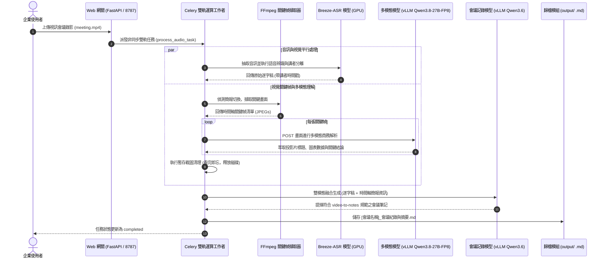

# 系統設計規格書 (System Design Document - SDD.md)
## 天工會議紀錄：多模態關鍵幀抽取與 VLM 視訊理解整合管線

---

## 1. 系統架構與選型 (Multimodal Architecture & Selection)

本系統擴充為**音視雙模態 (Audio-Visual Multimodal) 會議紀錄平台**。針對企業視訊會議錄影檔（MP4、MKV、MOV 等），系統整合了 **Breeze-ASR 語音辨識** 與 **多模態視覺模型 (VLM)**，在抽取音訊轉錄的同時，自動偵測投影片切換並抽取關鍵畫面，透過內網 VLM 提煉簡報標題、圖表數據與展示重點，並與語音逐字稿深度融合，產出符合 `skills/video-to-notes` 規範之高品質結構化會議記錄。

### 1.1 多模態處理管線架構圖 (Multimodal Pipeline Architecture)

```mermaid
flowchart TD
    Video[("視訊會議錄影檔\n(.mp4 / .mkv / .mov)")] --> Extractor["1. 關鍵幀擷取器\n(KeyframeExtractor / FFmpeg)"]
    Video --> AudioSplit["2. 音訊分離提取\n(Audio Extraction / FFmpeg -vn)"]

    subgraph VisualPipeline [視覺理解管線 (Visual Pipeline)]
        Extractor -->|"場景切換偵測 (scene > 0.3)\n定時步長取樣 (15s)"| Frames[("暫存關鍵幀 JPEGs\n(1280x720 輕量化)")]
        Frames --> VLMClient["VLM 多模態客戶端\n(http://192.168.1.100:8000/v1)"]
        VLMClient -->|"模型: Qwen/Qwen3.8-27B-FP8 (vLLM)"| VisualSummary[("時間軸視覺摘要 (VisualTimeline)\n- 投影片標題與章節\n- 圖表具體關鍵數據\n- 畫面發言人與展示重點")]
        VisualSummary --> Cleanup["看完即忘清理機制\n(自動安全刪除暫存截圖)"]
    end

    subgraph AudioPipeline [語音處理管線 (Audio Pipeline)]
        AudioSplit --> ASR["Breeze-ASR 模型推論\n(gpu_queue / 限流 Concurrency=1)"]
        ASR --> RawTranscript[("原始語音逐字稿\n(帶時間戳與講者代號)")]
    end

    subgraph FusionEngine [雙模態融合與提煉引擎 (Fusion & Minutes Engine)]
        RawTranscript --> Fusion["雙模態交叉校正與結構化提煉\n(LLM: 192.168.1.100:8002/v1)"]
        VisualSummary --> Fusion
        Fusion --> Notes[("Obsidian PKM 會議記錄 (.md)\n- YAML Frontmatter\n- Highlights (含簡報數據)\n- 決策事項表格\n- 待辦清單表格\n- 議題討論紀要 (標記【發言人】)\n- 下次會議追蹤表格\n- 文末 # 參考資料")]
    end
```

### 1.2 多模態處理序列圖 (Sequence Diagram)



---

## 2. 標準作業程序規範 (SOP Generation Protocol)

### 2.1 流程參數宣告 (Parameters)

```yaml
parameters:
  inputs:
    - name: video_file_path
      type: string
      required: true
      description: "輸入之視訊會議錄影檔案路徑 (.mp4, .mkv, .mov 等)"
    - name: vlm_url
      type: string
      default: "http://192.168.1.100:8000/v1"
      description: "多模態視覺模型端點 (vLLM OpenAI 相容 API)"
    - name: vlm_model
      type: string
      default: "auto"
      description: "多模態視覺模型名稱 (預設 auto 自動辨識 Qwen/Qwen3.8-27B-FP8)"
    - name: scene_threshold
      type: float
      default: 0.3
      description: "FFmpeg 簡報換頁切換敏感度 (0.0 ~ 1.0)"
    - name: min_interval_seconds
      type: integer
      default: 15
      description: "關鍵幀擷取最小間隔時間 (秒)，避免過密截圖"
    - name: max_keyframes
      type: integer
      default: 30
      description: "單一會議最多擷取之關鍵幀上限"
  outputs:
    - name: visual_timeline
      type: list[dict]
      description: "包含時間戳、投影片標題、圖表數據之結構化視覺摘要"
    - name: multimodal_meeting_notes
      type: string
      description: "融合發言與簡報數據之 Obsidian PKM 規格 Markdown 會議筆記"
  constraints:
    - "嚴格遵循零截圖原則：產出之 Markdown 文件 MUST NOT 包含實體截圖，視覺資料必須文字化萃取"
    - "看完即忘原則：VLM 分析完畢後 MUST 立即刪除所有本機暫存截圖，防止磁碟洩漏"
    - "平滑降級原則：若影片無影像軌或 VLM 連線逾時，MUST 自動回退為純音訊轉錄，流程 MUST NOT 中斷"
```

### 2.2 核心步驟流程 (Steps - RFC2119 Protocol)

1. 系統 **MUST** 檢驗輸入檔案副檔名。若為視訊格式（`.mp4`、`.mkv`、`.mov`、`.webm`、`.avi`），**MUST** 觸發多模態管線；若為純音訊格式（`.mp3`、`.wav`、`.m4a`），**MUST** 跳過視覺分析直接執行語音轉錄。
2. 關鍵幀擷取器 **MUST** 透過 `ffmpeg` 使用場景切換演算法 (`select='gt(scene,0.3)'`) 偵測投影片換頁，並將畫面縮放至 `1280x720` 以平衡解析度與推論效能。
3. 關鍵幀數量 **SHOULD NOT** 超過 `max_keyframes` 設定值（預設 30 張），以控制 VLM 總體推論時間與網路負載。
4. VLM 客戶端 **MUST** 將關鍵幀轉為 Base64 格式傳入多模態模型端點，Prompt **MUST** 強制要求聚焦於：**投影片核心主題、圖表具體數據、決策標示與發言人標籤**。
5. 多模態視覺摘要 **MUST** 結構化組織為時間軸標籤（例如 `[00:05:20] 投影片：Q3 業績指標 (營收成長 15%)`）。
6. 分析完畢後，清理模組 **MUST** 立即安全抹除所有本機暫存影像檔案。
7. 提煉引擎 **MUST** 將視覺摘要與 ASR 語音逐字稿合併，調用 LLM 生成符合 `skills/video-to-notes` 六大維度的 Obsidian Markdown 會議筆記。

### 2.3 異常與邊界處理 (Error Handling)

| 編號 | 異常情境 (Edge Case) | 觸發條件 (Criteria) | 對應行動 (Action) |
| :--- | :--- | :--- | :--- |
| **EH-01** | 視訊無有效影像軌或靜態黑畫面 | FFmpeg 抽取關鍵幀失敗，或產出之影像幀數量為 0 | 系統 **MUST** 記錄除錯日誌，自動標記 `visual_timeline = ""`，並 **MUST** 繼續執行標準 Breeze-ASR 音訊轉錄，**MUST NOT** 拋出例外中斷任務。 |
| **EH-02** | 外部 VLM 服務連線超時或崩潰 | 呼叫 Ollama / VLM 端點逾時 (超過 180 秒) 或回應 HTTP 5xx | 系統 **MUST** 捕捉 `TimeoutError` 或 `URLError`，記錄警告訊息，平滑降級使用純語音逐字稿進行會議筆記提煉，**MUST NOT** 造成 Celery Worker 重啟或任務失敗。 |
| **EH-03** | 視訊長度過長導致關鍵幀爆炸 | 會議錄影長達 3 小時以上，偵測到的場景切換大於 100 處 | 系統 **MUST** 啟動均勻抽樣機制 (Decimation Filter)，強制只保留最重要的 `max_keyframes` 幀畫面，**MUST NOT** 無限制呼叫 VLM 耗盡伺服器資源。 |
| **EH-04** | 暫存磁碟空間不足 | 建立臨時截圖目錄時磁碟剩餘空間小於 1GB | 系統 **MUST** 拒絕寫入暫存截圖，直接安全跳過視覺處理並降級至純語音模式，**MUST NOT** 引發磁碟耗盡崩潰。 |

---

## 3. 設定與配置分離 (Configuration & Environment)

* **`.env` (機密與環境端點)**：
  ```env
  VLM_URL=http://192.168.1.100:11434
  VLM_MODEL=qwen3.8:27b
  ```
* **`config.ini` (功能微調參數)**：
  ```ini
  [Vision]
  enabled = true
  vlm_url = http://192.168.1.100:11434
  vlm_model = qwen3.8:27b
  scene_threshold = 0.3
  min_interval_seconds = 15
  max_keyframes = 30
  ```
