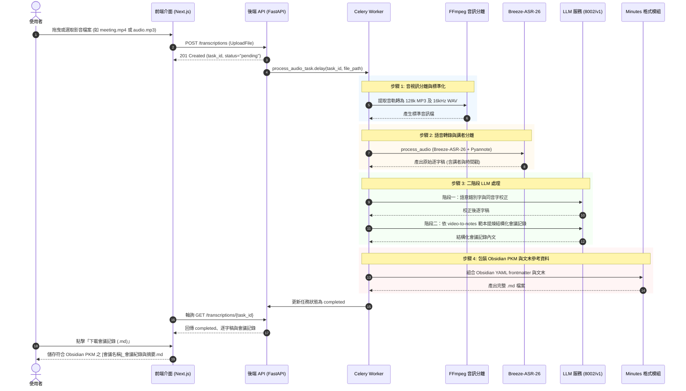
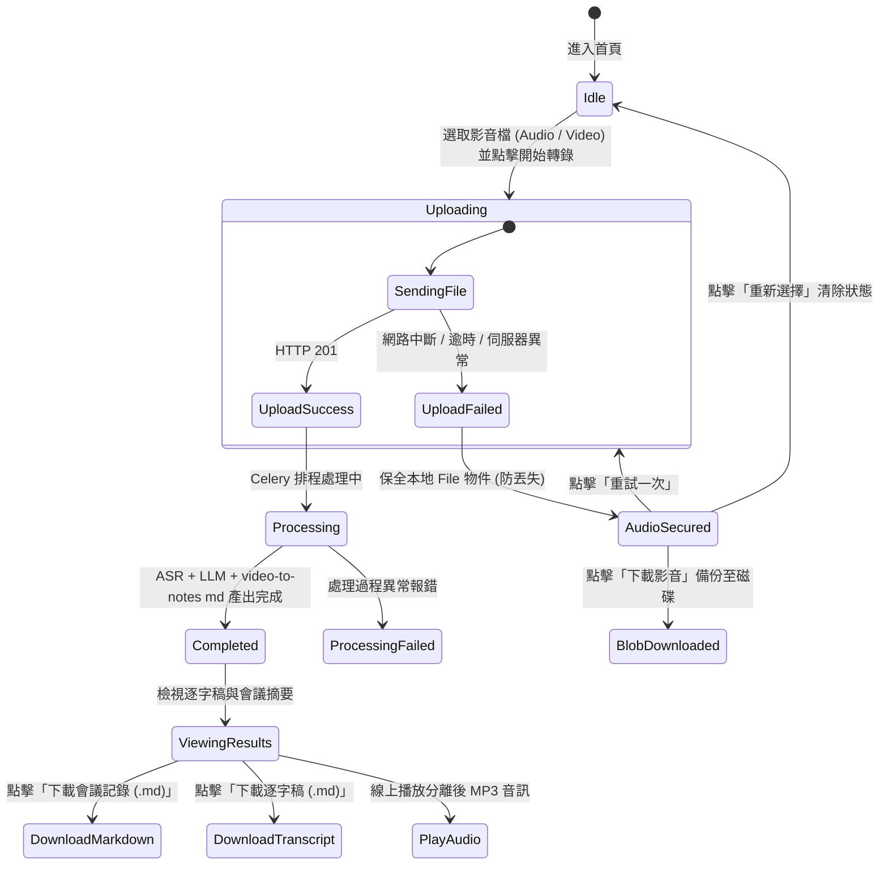

# 系統設計文件 (System Design Document, SDD)

## 1. parameters (YAML 屬性)

```yaml
inputs:
  media_file:
    type: File (UploadFile / LocalPath)
    formats: [.mp3, .wav, .m4a, .flac, .ogg, .webm, .mp4, .m4v, .mkv, .mov, .avi]
    max_size_mb: 2048
    description: 任何形式之會議影音檔案（支援純音訊、實體會議錄音、線上會議錄影 MP4/MKV/MOV/WEBM 等、瀏覽器麥克風即時收音）
  raw_transcript_file:
    type: File (Text / Markdown / Subtitle)
    formats: [.txt, .md, .srt]
    description: 已轉錄之逐字稿文字檔案（可直接跳過 ASR 進行校正與會議記錄生成）
  correction_config:
    llm_url: "http://192.168.1.100:8002/v1"
    model: "auto" # 支援透過 GET /v1/models 動態查詢帶入伺服器當前運行之模型
    timeout_seconds: 1800
    description: 錯別字與同音字語意校正模型設定
  summary_config:
    llm_url: "http://192.168.1.100:8002/v1"
    model: "auto" # 支援透過 GET /v1/models 動態查詢帶入伺服器當前運行之模型
    timeout_seconds: 1800
    description: 結構化會議記錄與摘要生成模型設定
  video_to_notes_spec:
    skill_path: "skills/video-to-notes"
    template_path: "skills/video-to-notes/asset/meeting_notes_template.md"
    target_format: "Markdown (.md) only"
    frontmatter_style: "Obsidian PKM YAML"
    video_ref_location: "End of document (# 參考資料)"
    table_formatting: "Standard GitHub Flavored Markdown Table"
  km_wiki_config:
    enabled: true
    raw_dir: "D:/km_wiki/raw"
    description: KM Wiki raw 資料夾自動同步設定

outputs:
  task_response:
    task_id: UUID string
    status: enum ["pending", "processing", "completed", "failed"]
  corrected_transcript:
    type: String (Text)
    description: 經 8002/v1 模型語意校正後之逐字稿，完整保留講者標籤與時間戳資訊
  meeting_notes_markdown:
    type: String (Markdown .md)
    frontmatter: |
      ---
      title : {{title}}
      description : 
      date : {{date}} {{time}}
      aliases : []
      status : inbox
      tags : 
      Topics : 
      Type : 
        - 📝/✨
      ---
    sections:
      - "# {{title}}"
      - "## 1. 會議基本資訊 (時間、地點、主席、記錄、出席、請假)"
      - "## 2. 會議核心摘要 (Highlights - 3~5 點高階成果)"
      - "## 3. 關鍵決策事項 (Decisions Made 表格：編號、主題、內容與共識、負責人、生效日期)"
      - "## 4. 待辦事項清單 (Action Items / Todo List 表格：任務、負責人、截止期限、狀態)"
      - "## 5. 各議題討論紀要 (Agenda & Discussions：標註【發言人】)"
      - "## 6. 下次會議追蹤項目 (Next Meeting Follow-ups 表格：追蹤項目、預計報告人、期望產出)"
      - "# 參考資料 (- [影音檔名])"
  archived_files:
    local_output: "output/YYYY-MM-DD/[會議名稱]_逐字稿.md, output/YYYY-MM-DD/[會議名稱]_會議紀錄與摘要.md"
    km_wiki_output: "{km_wiki_raw_dir}/YYYY-MM-DD/"

constraints:
  - 必須採用 Clean Architecture、S.O.L.I.D 與 CQRS 設計原則。
  - 無論語音還是視訊會議錄影，輸出統一為 .md (Markdown) 格式，不需要轉成 Word 檔。
  - 會議記錄內容格式 MUST 嚴格對齊 skills/video-to-notes 規格：開頭標準 Obsidian PKM YAML frontmatter，影音來源 MUST NOT 寫入 frontmatter，MUST 置於文末 # 參考資料。
  - 視訊會議錄影檔 (MP4, MKV, MOV, WEBM 等) 與音訊檔均 MUST 透過 ffmpeg 提取並標準化為 16kHz mono WAV 供 ASR 辨識，並轉出 MP3 供前端線上播放。
  - 前端上傳任何影音檔案失敗時，MUST 完整保全瀏覽器端檔案物件，且 MUST 提供「重試一次」與「下載影音」按鈕，防止使用者錄影或錄音遺失。
  - 系統必須提供獨立 Python 腳本 (scripts/transcribe_and_summarize.py) 與 Web API 雙重入口。
```

---

## 2. Mermaid 系統架構與流程圖

### 2.1 全管道架構與選型圖 (Architecture & Tech Stack)
```mermaid
graph TD
    subgraph Client [客戶端雙接入層]
        Script["獨立腳本 (CLI Script)<br/>scripts/transcribe_and_summarize.py"]
        WebUI["現代化網頁前端 (Next.js / React)"]
    end

    subgraph MediaProcessor [音視訊預處理層]
        FFmpeg["FFmpeg 音視訊分離與標準化<br/>(16kHz mono WAV / 128k MP3)"]
    end

    subgraph CoreBackend [核心後端與共用業務層]
        API["FastAPI Controller<br/>RESTful API"]
        Celery["Celery Background Worker"]
        LLMService["共用 LLM 服務層<br/>(src/taigi_asr/llm.py)"]
        ASR["Breeze-ASR-26 轉寫引擎"]
        MinutesService["video-to-notes 格式模組<br/>(src/taigi_asr/minutes.py)"]
        DB[(PostgreSQL / SQLite)]
    end

    subgraph ExternalLLM [外部推論模型 (192.168.1.100:8002/v1)]
        LLM_Correction["語意錯別字校正模型<br/>(動態 /v1/models 查詢)"]
        LLM_Summary["video-to-notes 結構化會議記錄提煉模型"]
    end

    subgraph Storage [輸出持久化與備份]
        LocalDisk["本機歸檔 output/YYYY-MM-DD/<br/>.md 逐字稿 / .md 會議筆記"]
        KMWiki["KM Wiki raw/ (D:/km_wiki/raw)"]
    end

    Script -->|輸入音訊或視訊| FFmpeg
    FFmpeg -->|音訊饋入| ASR
    ASR -->|原始逐字稿| LLMService
    LLMService -->|API 請求| ExternalLLM
    LLMService -->|校正逐字稿與摘要| MinutesService
    MinutesService -->|輸出 Markdown 筆記| LocalDisk

    WebUI -->|RESTful API| API
    API -->|建立任務| DB
    API -->|非同步派發| Celery
    Celery -->|分離影音| FFmpeg
    Celery -->|音訊轉寫| ASR
    Celery -->|調用| LLMService
    Celery -->|格式化為 Obsidian PKM md| MinutesService
    Celery -->|更新狀態| DB
    Celery -->|自動歸檔| LocalDisk
    WebUI -->|下載 .md 筆記| API
```

### 2.2 視訊與語音會議轉會議記錄序列圖 (Sequence Diagram)


### 2.3 影音上傳與保全狀態機圖 (State Diagram)


---

## 3. RESTful API 規格 (API Planning)

### 3.1 `POST /api/v1/transcriptions`
- **說明**：上傳影音檔案（音訊或視訊會議錄影），建立轉錄任務。
- **請求格式**：`multipart/form-data`
- **參數**：`file`: 影音檔案（支援 `.mp3`, `.wav`, `.m4a`, `.mp4`, `.mkv`, `.mov`, `.webm`, `.avi` 等）。
- **回應代碼**：`201 Created`
- **回應內容**：
  ```json
  {
    "id": "c1f7a83b-9a81-4235-9f50-6bc77098c11e",
    "status": "pending",
    "message": "Media file uploaded successfully, processing started."
  }
  ```

### 3.2 `GET /api/v1/transcriptions/{task_id}`
- **說明**：查詢轉錄任務當前狀態與內容。
- **回應內容**：
  ```json
  {
    "id": "c1f7a83b-9a81-4235-9f50-6bc77098c11e",
    "status": "completed",
    "transcript": "...",
    "summary": "...",
    "error_message": null,
    "created_at": "2026-09-16T05:30:00Z"
  }
  ```

### 3.3 `GET /api/v1/transcriptions/{task_id}/audio`
- **說明**：取得供前端線上播放之音訊檔（即使上傳視訊，後端亦會提取並提供 mp3 串流）。

---

## 4. 核心步驟流程 (Steps - RFC2119 SOP Protocol)

執行端（Agent 或系統工作流）**MUST** 嚴格遵循以下 SOP 規範執行：

### STEP 1: 影音輸入接收與音訊分離標準化
1. 系統 **MUST** 支援使用者上傳純音訊檔或視訊錄影檔（包含但不限於 `.mp4`, `.mkv`, `.mov`, `.webm`, `.avi`）。
2. 系統 **MUST** 使用 `ffmpeg` 自動提取音軌，並標準化轉出供 ASR 辨識之 16kHz mono WAV 檔與供前端播放之 128k MP3 檔。
3. 若為純音訊，系統 **SHOULD** 同樣檢驗並轉換為相容播放之 MP3 格式。

### STEP 2: Breeze-ASR-26 轉錄與講者辨識
1. 系統 **MUST** 調用 `Breeze-ASR-26` 模型結合講者辨識管線，產出標註有發言者代號與精準時間戳的原始逐字稿。
2. 若使用者直接提供現有逐字稿文字檔，系統 **MAY** 略過音訊處理與 ASR 步驟。

### STEP 3: 語意錯別字校正 (LLM 階段一)
1. 系統 **MUST** 調用 `http://192.168.1.100:8002/v1` 模型，依據上下文語意修復台語與中文同音錯別字、專有名詞與標點符號。
2. 系統 **MUST** 完整保留原始逐字稿中的講者代號與時間戳記，嚴禁隨意刪減發言內容。
3. 系統 **MUST** 自動解析並過濾模型可能輸出之 `<think>...</think>` 推理標籤。

### STEP 4: 提煉符合 video-to-notes 規範之結構化會議記錄 (LLM 階段二)
1. 產出之會議記錄 Markdown **MUST** 於開頭包含標準 Obsidian PKM YAML Frontmatter。
2. 影音檔案來源 **MUST NOT** 寫入 frontmatter，**MUST** 置於文件最末端 `# 參考資料` 章節，格式為 `- [影音檔名]`。
3. 會議內容 **MUST** 結構化提煉為：
   - `# {{title}}`
   - `## 1. 會議基本資訊`
   - `## 2. 會議核心摘要 (Highlights)`
   - `## 3. 關鍵決策事項 (Decisions Made 表格)`
   - `## 4. 待辦事項清單 (Action Items / Todo List 表格)`
   - `## 5. 各議題討論紀要 (Agenda & Discussions，標記【發言人】)`
   - `## 6. 下次會議追蹤項目 (Next Meeting Follow-ups 表格)`
   - `# 參考資料 (- [影音檔名])`
4. 檔案形式以純 `.md` 呈現與儲存，**MUST NOT** 額外轉換為 Word 檔案。

### STEP 5: 持久化歸檔與成果下載
1. 系統 **MUST** 將校正逐字稿 (`.md`) 與會議記錄 (`.md`) 儲存至 `output/YYYY-MM-DD/`。
2. 前端介面 **MUST** 提供會議記錄 `.md` 與逐字稿 `.md` 下載功能。
3. 若啟用 KM Wiki 同步，系統 **SHOULD** 將成果複製至 `KM_WIKI_RAW_DIR`。

---

## 5. 異常與邊界處理 (Error Handling - RFC2119)

| 邊界狀況 (Edge Case) | 觸發條件 (Criteria) | 對應處置行動 (Action) |
|---|---|---|
| **Edge Case 1: 視訊檔案無音軌或音軌損毀** | 傳入之視訊檔未包含音軌串流，或 ffmpeg 提取時回傳錯誤碼。 | 系統 **MUST** 捕捉 ffmpeg 例外，將任務狀態標記為 `failed`，並向使用者回傳明確錯誤提示「該視訊檔案未包含有效音軌或格式已損毀」，**MUST NOT** 拋出未捕獲例外導致服務崩潰。 |
| **Edge Case 2: 前端上傳大檔案視訊時遭遇網路逾時或中斷** | 瀏覽器發送 POST 請求時發生網路連線失敗、伺服器重啟或 HTTP 504 Gateway Timeout。 | 前端 **MUST NOT** 清空已選取之 `File` 物件；前端狀態 **MUST** 切換至 `failed`，並立即提供「重試一次」按鈕與「下載影音」按鈕，確保幾百 MB 至數 GB 的視訊錄影不必重複耗時重新選取或遺失。 |
| **Edge Case 3: 會議內容無具體決策或待辦事項** | 該次視訊/音訊會議為純現況同步會或技術分享會，會中無任何表決決策與指派任務。 | 系統 **MUST NOT** 報錯崩潰；系統 **MUST** 在決策與 Todo 區塊優雅呈現「本會議為資訊同步會議，無新增表決決策與待辦追蹤項目」。 |
| **Edge Case 4: LLM 產生之 frontmatter 缺少必要屬性** | 外部推論模型回應格式未完全對齊 YAML frontmatter 標記。 | 格式化模組 `minutes.py` **MUST** 具備自動防護校驗，若缺少標準 frontmatter 則自動補全 Obsidian PKM 標準屬性，並將檔名注入最末端 `# 參考資料`。 |
