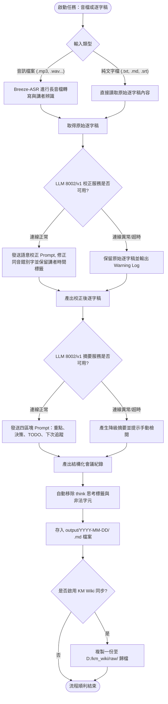
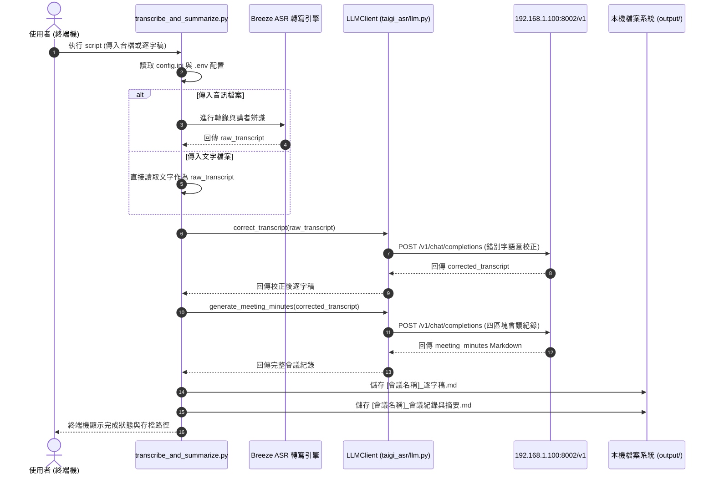
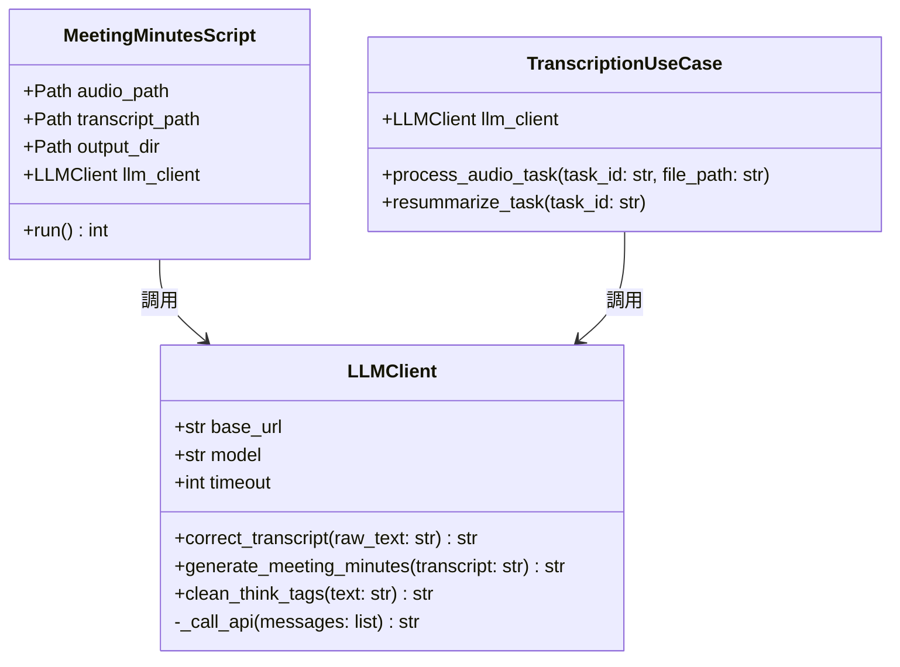
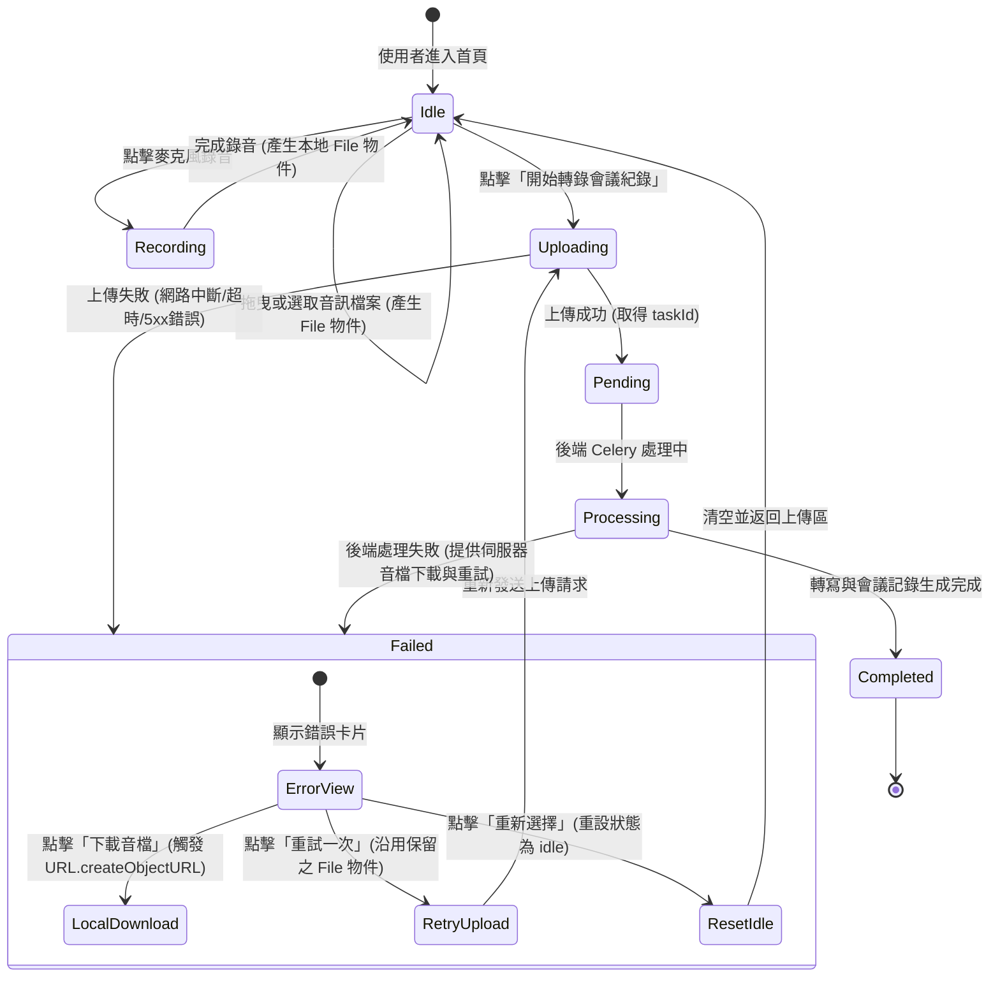

# 系統設計文件 (System Design Document, SDD)

## 1. parameters (YAML 屬性)

```yaml
inputs:
  audio_file:
    type: File (UploadFile / LocalPath)
    formats: [.mp3, .wav, .m4a, .flac, .ogg, .webm, .mp4, .m4v, .mkv]
    max_size_mb: 2048
    description: 原始會議音訊檔案
  raw_transcript_file:
    type: File (Text / Markdown / Subtitle)
    formats: [.txt, .md, .srt]
    description: 已轉錄之逐字稿文字檔案（可直接作為校正與摘要輸入）
  correction_config:
    llm_url: "http://192.168.1.100:8002/v1"
    model: "auto" # 支援透過 GET /v1/models 動態查詢帶入伺服器當前運行之模型
    timeout_seconds: 1800
    description: 錯別字與同音字語意校正模型設定
  summary_config:
    llm_url: "http://192.168.1.100:8002/v1"
    model: "auto" # 支援透過 GET /v1/models 動態查詢帶入伺服器當前運行之模型
    timeout_seconds: 1800
    description: 結構化會議記錄與摘要生成模型設定
  km_wiki_config:
    enabled: true
    raw_dir: "D:/km_wiki/raw"
    description: KM Wiki raw 資料夾自動同步設定

outputs:
  task_response:
    task_id: UUID string
    status: enum ["pending", "processing", "completed", "failed"]
  corrected_transcript:
    type: String (Text)
    description: 經 8002/v1 模型語意校正後之逐字稿，完整保留講者標籤與時間戳資訊
  meeting_summary:
    type: String (Markdown)
    sections:
      - "# 會議名稱：[主題]"
      - "## 【會議重點】"
      - "## 【關鍵決策】"
      - "## 【TODO / 行動項目】"
      - "## 【下次會議追蹤項目】"
  archived_files:
    local_output: "output/YYYY-MM-DD/[會議名稱]_逐字稿.md, output/YYYY-MM-DD/[會議名稱]_會議紀錄與摘要.md"
    km_wiki_output: "{km_wiki_raw_dir}/YYYY-MM-DD/"

constraints:
  - 必須採用 Clean Architecture、S.O.L.I.D 與 CQRS 設計原則。
  - 核心 LLM 呼叫與校正邏輯必須封裝為共用服務模組 (src/taigi_asr/llm.py)，同時提供 CLI 腳本與後端 API 複用。
  - 系統必須提供獨立 Python 腳本 (scripts/transcribe_and_summarize.py)，支援在命令列以 script 直接執行轉會議紀錄。
  - 金鑰與伺服器位址必須設定於 .env 與 config.ini 中，禁止硬編碼 (Hardcoding)；設定優先順序為 CLI 參數 > .env > config.ini > 預設值。
  - 若 LLM 服務發生網路超時或例外狀況，系統 MUST 採取優雅降級 (Graceful Degradation)，保留原始文字並回報明確警示，不可崩潰。
  - 前端上傳音檔若遭遇連線中斷、超時或伺服器異常，系統 MUST 完整保全瀏覽器端音檔物件，且 MUST 提供「重試一次」與「下載音檔」功能，確保使用者錄音或選取之檔案絕不遺失。
```

---

## 2. Mermaid 系統架構與流程圖

### 2.1 雙重進入點架構選型圖 (Architecture & Tech Stack)
```mermaid
graph TD
    subgraph Client [客戶端接入]
        Script["獨立腳本 (CLI Script)<br/>scripts/transcribe_and_summarize.py"]
        WebUI["網頁前端 (Next.js)"]
    end

    subgraph CoreBackend [後端與共用服務]
        API["FastAPI Controller"]
        Celery["Celery Background Worker"]
        LLMService["共用 LLM 服務層<br/>(src/taigi_asr/llm.py)"]
        ASR["Breeze-ASR-26 轉寫引擎"]
        DB[(PostgreSQL / SQLite)]
    end

    subgraph ExternalLLM [外部推論模型 (192.168.1.100:8002/v1)]
        LLM_Correction["語意錯別字校正模型"]
        LLM_Summary["四大結構化會議紀錄整理模型"]
    end

    subgraph Storage [持久化與歸檔]
        LocalDisk["本機歸檔 output/YYYY-MM-DD/"]
        KMWiki["KM Wiki raw/ (D:/km_wiki/raw)"]
    end

    Script -->|調用| ASR
    Script -->|調用| LLMService
    Script -->|儲存| LocalDisk
    Script -.->|可選同步| KMWiki

    WebUI -->|RESTful API| API
    API -->|寫入任務| DB
    API -->|派發佇列| Celery
    Celery -->|轉音| ASR
    Celery -->|調用| LLMService
    Celery -->|更新紀錄| DB
    Celery -->|自動歸檔| LocalDisk
    Celery -.->|可選同步| KMWiki

    LLMService -->|POST /chat/completions (校正)| LLM_Correction
    LLMService -->|POST /chat/completions (摘要)| LLM_Summary
```

### 2.2 關鍵流程圖 (Key Process Flow)


### 2.3 序列圖 (Sequence Diagram - Script 執行)


### 2.4 類別圖 (Class Diagram)


### 2.5 前端上傳容錯與音檔保全狀態圖 (State Diagram)


---

## 3. Steps (核心步驟流程 - RFC2119 規範)

1. **前端音檔接收與保全階段**：
   - 使用者透過檔案選擇、拖曳或網頁麥克風錄音產生之音訊檔案，前端 **MUST** 妥善保存於記憶體狀態（`File` 物件）中。
   - 在上傳請求發起直至確認成功前，前端 **MUST NOT** 提前釋放或清空 `file` 物件。
   - 若上傳請求失敗（發生 Network Error、HTTP 4xx/5xx 或逾時），前端 **MUST** 切換至 `failed` 狀態並完整保留 `file` 物件。
   - 前端 **MUST** 提供「下載音檔」按鈕，允許使用者直接觸發瀏覽器下載本機音訊（使用 `URL.createObjectURL`），防止因頁面重新整理或斷線造成錄音資料永久遺失。
   - 前端 **MUST** 提供「重試一次」按鈕，點擊後 **MUST** 直接利用現有 `file` 物件重新觸發上傳流程，無需使用者重複操作選取或重新錄音。

2. **參數解析與配置載入**：
   - 執行腳本時，系統 **MUST** 檢查命令列參數，至少提供 `--audio` 或 `--transcript` 其中一項。
   - 系統 **MUST** 依優先順序（CLI 參數 > `.env` > `config.ini` > 預設值）載入 `LLM_CORRECTION_URL`、`LLM_MODEL` 及 `timeout`。

2. **ASR 音訊轉寫階段**（若輸入為音檔）：
   - 系統 **MUST** 驗證音檔路徑存在且格式有效。
   - 系統 **SHOULD** 使用 Breeze-ASR-26 進行長音檔轉錄，產出帶時間戳與講者資訊之原始逐字稿。

3. **語意錯別字校正階段 (LLM Step 1)**：
   - 系統 **MUST** 將原始逐字稿輸入至 `http://192.168.1.100:8002/v1` 模型。
   - 提示詞 **MUST** 要求模型依前後文語意修復錯別字、同音異字及專有名詞。
   - 模型輸出 **MUST NOT** 擅自刪除或修改原始時間戳與講者標記。
   - 系統 **MUST** 自動清除 `<think>...</think>` 推理標記。

4. **結構化會議紀錄整理階段 (LLM Step 2)**：
   - 系統 **MUST** 將校正後的逐字稿輸入至會議記錄生成端點。
   - 輸出的 Markdown 文件 **MUST** 嚴格包含以下區塊：
     1. 第一行標題：`# 會議名稱：[主題]`
     2. `## 【會議重點】`
     3. `## 【關鍵決策】`
     4. `## 【TODO / 行動項目】`（條列待辦，包含負責人與預計完成日）
     5. `## 【下次會議追蹤項目】`
   - 系統 **MUST** 確保不虛構未提及之日期、決策或人員。

5. **檔案輸出與同步歸檔**：
   - 系統 **MUST** 自動由會議記錄第一行提煉會議主題，並過濾作業系統非法字元。
   - 系統 **MUST** 建立 `output/YYYY-MM-DD/` 資料夾，並匯出兩份檔案：
     - `[會議名稱]_逐字稿.md`
     - `[會議名稱]_會議紀錄與摘要.md`
   - 若 `KM_WIKI_ENABLED=true`，系統 **SHOULD** 同步複製上述檔案至指定的 KM Wiki raw 資料夾。

---

## 4. Error Handling (異常與邊界處理)

| Edge Case | 觸發條件 (Criteria) | 對應行動 (Action) |
|---|---|---|
| **EC-1: 192.168.1.100:8002 服務連線超時或網路斷線** | 發送 HTTP 請求超過 1800 秒，或拋出 `URLError` / `ConnectionRefusedError` | 系統 **MUST** 捕捉例外並印出警告訊息，**MUST** 自動降級將原始逐字稿做為校正輸出；若摘要亦連線失敗，摘要部分 **MUST** 輸出降級提示文字「摘要生成失敗：無法連線至 LLM 服務」，整體腳本 **MUST NOT** Crash 崩潰，維持正常輸出儲存。 |
| **EC-2: 模型輸出包含思考標籤 `<think>` 或回傳空白** | LLM 響應的 `content` 包含推理模型之 `<think>` 標記，或因長度問題回傳空字串 | 系統 **MUST** 透過正規表示式自動濾除 `<think>.*?</think>` 標籤並擷取乾淨文字；若過濾後為空，系統 **MUST** 填入「模型回傳空白結果，請檢查模型參數或重試」。 |
| **EC-3: 逐字稿過長或為空** | 逐字稿為空文字，或長度超過模型上下文窗口上限 | 若逐字稿為空，系統 **MUST** 立即終止後續 LLM 呼叫並提醒「逐字稿為空，無需校正與生成紀錄」；若超長，系統 **SHOULD** 支援段落切割或於提示詞截斷保護。 |
| **EC-4: 會議名稱提煉失敗或包含非法檔名字元** | 第一行未包含 `# 會議名稱：` 或字串含有 `\ / : * ? " < > \|` | 系統 **MUST** 使用 `sanitize_filename` 消除非法符號；若無會議名稱，**MUST** 自動退回以輸入檔名或日期時間作為檔案名稱。 |
| **EC-5: KM Wiki raw 資料夾無法存取** | 指定之 `KM_WIKI_RAW_DIR` 不存在、權限不足或網路中斷 | 系統 **MUST** 捕捉 `IOError` 並印出 Warning Log，**MUST NOT** 中斷本地輸出流程。 |
| **EC-6: 前端音檔上傳中斷或伺服器異常** | 上傳音檔發送 POST /api/v1/transcriptions 時網路斷線、請求逾時或後端回傳 5xx / 413 等錯誤 | 前端 **MUST** 捕捉例外進入 `failed` 狀態，且 **MUST NOT** 清空已選取或錄製之 `File` 物件；系統 **MUST** 於錯誤卡片呈現「重試一次」按鈕供立即重試，並 **MUST** 提供「下載音檔」按鈕以觸發瀏覽器下載本地音檔備份，防止音檔遺失。 |

---

## 5. 獨立執行腳本規劃 (CLI Script Specification)

### 5.1 腳本路徑與指令範例
- 腳本位置：`scripts/transcribe_and_summarize.py`
- 執行方式：
  ```bash
  # 方式 A：直接轉錄音檔並生成會議記錄
  uv run python scripts/transcribe_and_summarize.py --audio path/to/meeting.mp3

  # 方式 B：將現有逐字稿轉為會議記錄
  uv run python scripts/transcribe_and_summarize.py --transcript path/to/raw_transcript.txt

  # 方式 C：覆寫自訂模型與端點
  uv run python scripts/transcribe_and_summarize.py --audio meeting.wav --url http://192.168.1.100:8002/v1 --model Qwen/Qwen3.8-27B-FP8
  ```

### 5.2 參數表 (CLI Arguments)
- `--audio` (`-a`): 音訊檔案路徑。
- `--transcript` (`-t`): 已有逐字稿文字檔案路徑（與 `--audio` 二擇一）。
- `--output-dir` (`-o`): 輸出目錄（預設為 `output/YYYY-MM-DD/`）。
- `--url`: LLM API 位址（預設從 `config.ini` / `.env` 讀取）。
- `--model`: LLM 模型名稱（預設從 `config.ini` / `.env` 讀取）。
- `--skip-correction`: 是否跳過錯別字校正步驟（選用，預設執行校正）。
- `--verbose` (`-v`): 詳細偵錯日誌輸出。
