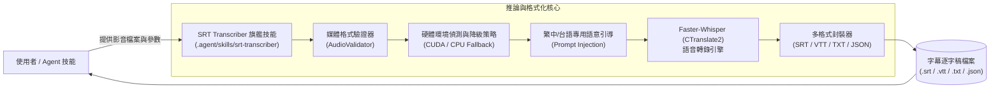
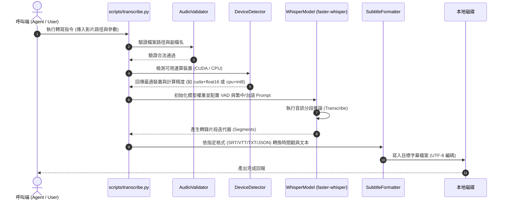
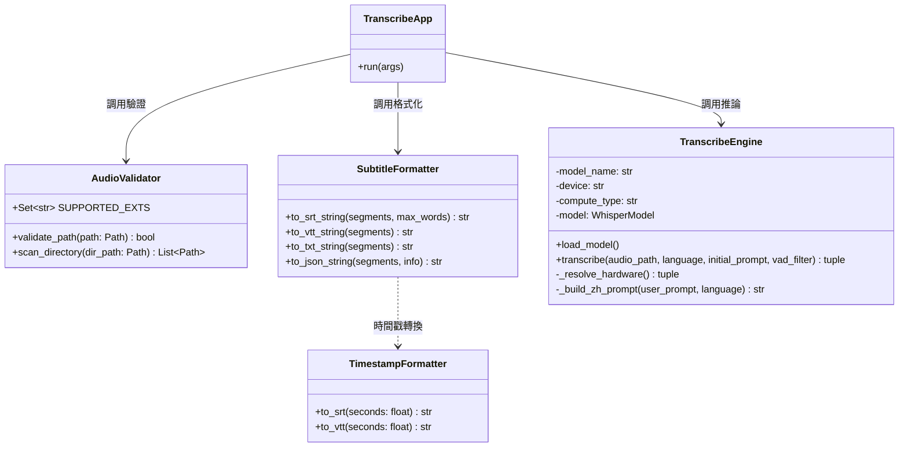
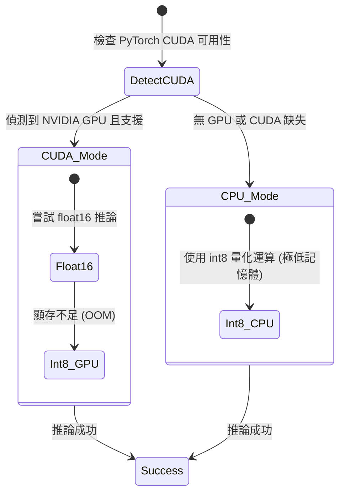

# 系統設計文件 (System Design Document - SDD)
## 專案名稱：SRT Transcriber 旗艦版 (三合一整合影音轉逐字稿技能)

---

## 1. 系統脈絡與架構選型 (System Context & Architecture)

### 1.1 系統脈絡圖 (System Context Diagram)

### 1.2 技術選型與決策矩陣
| 維度 | 選型方案 | 優勢與架構考量 |
|---|---|---|
| **核心台語/繁中模型** | **MediaTek Breeze-ASR-26** (`paulpengtw/faster-whisper-Breeze-ASR-26-ct2`) | 聯發創新基地 (MediaTek Research) 專為台灣華語口音、中英混用與台語 (Taigi) 深度調校的旗艦模型，台語與繁中辨識率顯著優於通用 Whisper。 |
| **通用多國語言模型** | `large-v3` / `medium` (OpenAI Whisper) | 支援 90+ 種語言自動偵測，可透過 `--model` 自由指定切換。 |
| **推論加速引擎** | `faster-whisper` (CTranslate2) | 效能較原生 PyTorch 提升 4 倍以上，記憶體佔用降低 50% 以上，相容 RTX 3050 4GB VRAM 與 CPU int8。 |
| **繁中/台語支援** | 專屬 Prompt 注入 + `zh-TW` 映射至 `zh` | 將常見台語詞彙（如「調機」、「夾爪」、「巡檢」）與繁體中文規範透過 Initial Prompt 傳入，有效壓制簡體字與同音雜訊。 |
| **套件管理** | `uv` (Windows 11) | 極速安裝、隔離環境、零跨專案污染。 |

---

## 2. 關鍵流程時序圖 (Sequence Diagram)

---

## 3. 類別設計架構 (Class Diagram - S.O.L.I.D.)

---

## 4. 關鍵機制與設計細節

### 4.1 台灣繁中與台語語意引導 (Prompt Injection)
當指定 `--language zh-TW` 或轉錄包含台語內容時，系統自動將語言代碼正規化為 `zh`，並注入預設 Initial Prompt：
> 「這是一段繁體中文與台灣台語對話，包含各項專業工程、機台操作、換模調機、公差規格與品質管理術語，請輸出繁體中文。」

### 4.2 硬體自適應降級策略 (Hardware Fallback)

### 4.3 Windows 控制台編碼防護 (cp950 Protection)
在 Windows 繁體中文環境下，標準控制台輸出預設為 `cp950`，容易在印出特殊 UTF-8 符號時崩潰。
腳本全面於 CLI 入口點配置安全輸出保護，確保跨平臺穩定。
