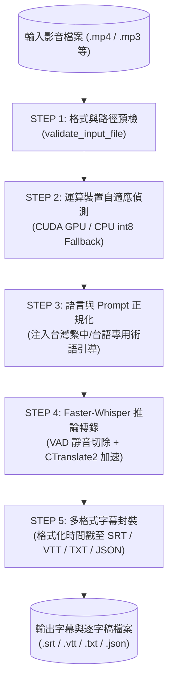

# 影音轉字幕逐字稿標準作業流程 (SRT Transcriber 旗艦版)

本技能為影音轉字幕逐字稿之旗艦整合工作流程，已完整融合同步原 `srt-transcriber`、`srt-transcriber-zh` 與 `srt-faster-whisper` 的全部功能：**支援多模型自由切換 (`large-v3`, `medium`, `en`)、台灣繁中與台語特化 Prompt 語意引導、VAD 靜音過濾、GPU/CPU 自適應降級**，並全面由專屬腳本全自動化執行。

## 流程參數宣告 (Parameters - YAML 屬性)

```yaml
parameters:
  inputs:
    media_source: "[影片或音訊檔案路徑，支援 mp4, mkv, avi, mp3, wav, m4a 等]"
    model_name: "breeze-asr (預設台語/繁中旗艦; 可選: breeze-asr, large-v3, medium, small, base, tiny)"
    language: "zh-TW (可選: zh-TW, zh, en, ja，預設 zh-TW)"
    format: "srt (可選: srt, vtt, txt, json，支援逗號多選)"
  outputs:
    subtitle_files: "[媒體名稱].srt (或對應指定之 .vtt, .txt, .json)"
  constraints:
    rfc2119_compliance: TRUE
    script_driven_execution: TRUE
    prohibit_manual_scripting: TRUE
    local_privacy_guarantee: TRUE
    auto_hardware_fallback: TRUE
    core_model_taigi_optimized: "MediaTek Breeze-ASR-26 (paulpengtw/faster-whisper-Breeze-ASR-26-ct2)"
```

---

## 關鍵流程與管線架構 (Pipeline Architecture)



---

## 核心步驟規範 (Steps - RFC2119 Protocol)

執行端（Agent）**MUST** 嚴格依循以下步驟順序執行，並遵守 RFC2119 規範強度：

### STEP 1: 影音來源確認與參數選擇
1. Agent **MUST** 先行確認輸入之影音檔案是否存在，且副檔名屬於支援格式清單（影片：`.mp4`, `.mkv`, `.avi`, `.mov`, `.wmv`, `.flv`, `.webm`；音訊：`.mp3`, `.wav`, `.m4a`, `.flac`, `.ogg`, `.aac`, `.wma`）。
2. Agent **SHOULD** 依據任務類型選定最適模型與語言參數：
   - **繁體中文或台灣台語對話 (預設核心推薦)**：**MUST** 採用預設模型 `--model breeze-asr`（解析為聯發科技 `paulpengtw/faster-whisper-Breeze-ASR-26-ct2`）並設定 `--language zh-TW`。
   - **一般多國外語或高精度需求**：**SHOULD** 切換指定為 OpenAI `--model large-v3` 或 `--model medium`。
   - **純英文內容**：**MAY** 傳入 `--language en` 加速轉寫。

### STEP 2: 全自動腳本調用執行 (禁止手寫臨時程式碼)
1. Agent **MUST NOT** 在工作區臨時撰寫 Python 轉錄腳本。
2. Agent **MUST** 直接調用本技能標準腳本 `scripts/transcribe.py`（在背景非同步執行）：
   ```bash
   uv run --link-mode copy .agent/skills/srt-transcriber/scripts/transcribe.py "path/to/media.mp4" [選項]
   ```
3. **常用範例指令**：
   - **標準繁中/台語轉錄 (預設採用 MediaTek Breeze-ASR，產出同名 .srt)**：
     ```bash
     uv run --link-mode copy .agent/skills/srt-transcriber/scripts/transcribe.py "會議錄影.mp4" --language zh-TW
     ```
   - **指定多格式同步輸出 (同時產出 SRT 字幕與 TXT 逐字稿)**：
     ```bash
     uv run --link-mode copy .agent/skills/srt-transcriber/scripts/transcribe.py "訪談.mp3" --format srt,txt --language zh-TW
     ```
   - **切換通用多國語言大型模型 (OpenAI Whisper large-v3)**：
     ```bash
     uv run --link-mode copy .agent/skills/srt-transcriber/scripts/transcribe.py "外語培訓.mp4" --model large-v3 --format srt
     ```
   - **開啟 VAD 語音活動降噪切除**：
     ```bash
     uv run --link-mode copy .agent/skills/srt-transcriber/scripts/transcribe.py "機台操作.mp4" --vad-filter --language zh-TW
     ```

### STEP 3: 字幕產出檢驗與回報
1. Agent **MUST** 檢驗輸出檔案（如 `[檔案名稱].srt`）是否成功產生於磁碟中，且檔案大小大於 0 位元組。
2. Agent **SHOULD** 檢視字幕前數行之時間戳格式（必須為 `00:00:00,000 --> 00:00:00,000`）與文字編碼（UTF-8），確認無亂碼。

---

## 異常與邊界處置 (Error Handling - RFC2119)

針對語音轉錄流程中可能遭遇之異常狀況，Agent **MUST** 遵照以下規範處置：

| 邊界狀況 (Edge Case) | 觸發條件 (Criteria) | 對應處置行動 (Action) |
|---|---|---|
| **Edge Case 1: GPU 顯存不足 (OOM) 或 CUDA 缺失** | 載入模型時拋出 `CUDA out of memory` 或系統無支援之 GPU。 | 腳本 **MUST** 自動捕捉異常並平滑降級至 CPU 模式（以 `int8` 量化執行），**MUST NOT** 中斷任務；終端機 **SHOULD** 印出降級提示。 |
| **Edge Case 2: Windows OneDrive 雲端檔案永久連結限制** | `uv run` 安裝套件時拋出 `os error 396: 無法在具有不相容永久連結的檔案上執行此雲端作業`。 | 執行指令時 **MUST** 加入參數 `--link-mode copy`，強制 UV 以複製取代永久連結，確保跨平臺穩定運作。 |
| **Edge Case 3: 影音包含極長背景雜音或無人聲** | 影片全篇為環境機台運轉聲、無任何口白，或逐字稿產生重複單字幻覺。 | Agent **MUST** 啟用 `--vad-filter` 參數重新執行；若轉出之字幕為空，Agent **MUST** 判定為「純環境音影片」，並於關聯文件標註「無說明口白」。 |
| **Edge Case 4: 中文路徑或 Windows 控制台編碼問題** | 路徑包含中文或特殊字符時，CLI 拋出 `UnicodeEncodeError: 'cp950'`。 | 腳本 **MUST** 內建 `sys.stdout` UTF-8 安全包裝器；輸入路徑處理 **MUST** 統一轉化為 `Path.resolve()`，杜絕編碼崩潰。 |

---

## 參考資源與規範文件

- 工具使用手冊：[`README.md`](README.md)
- 資安與隱私政策：[`sec.md`](sec.md)
- 系統架構設計：[`SDD.md`](SDD.md)
- 行為驗收規格：[`BDD.md`](BDD.md)
