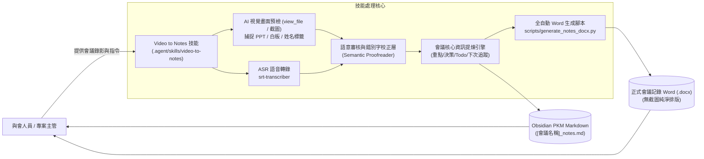
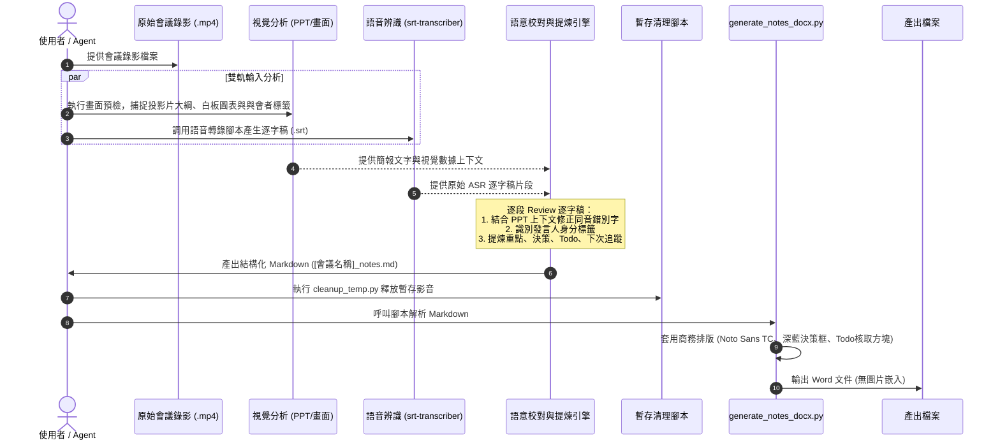
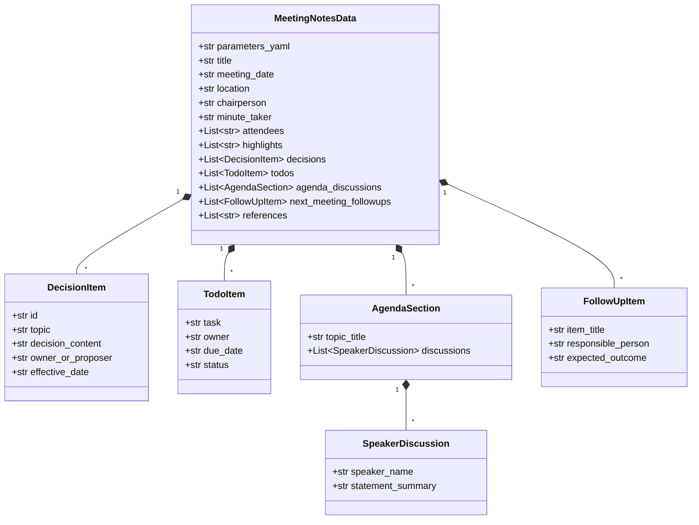
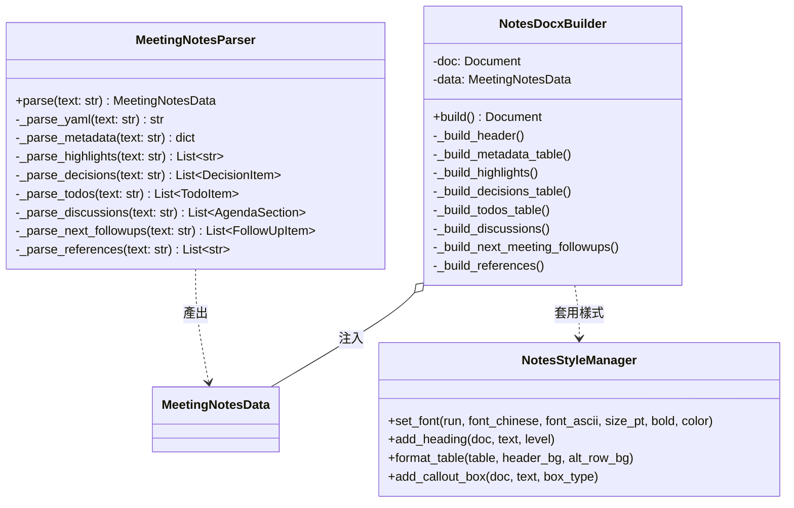

# 系統設計文件 (System Design Document - SDD)
## 專案名稱：Video to Notes (視訊會議轉會議記錄技能)

---

## 1. 系統脈絡與架構選型 (System Context & Technology Stack)

### 1.1 系統脈絡圖 (System Context Diagram)

### 1.2 技術選型與環境約束
| 構件維度 | 選型方案 | 決策考量與優勢 |
|---|---|---|
| **作業系統環境** | Windows 11 (PowerShell) | 與現行工程開發及主管作業環境完全一致。 |
| **Python 套件管理** | [uv](https://github.com/astral-sh/uv) | 高效虛擬環境隔離與極速套件解析，杜絕環境污染。 |
| **文件渲染核心** | `python-docx` + `pyyaml` | 純本地處理，可高度控制中英文字體、階層字級與表格邊框樣式。 |
| **語音轉錄核心** | `faster-whisper` (本地執行) | 離線轉錄保證會議隱私不外洩，具備時間戳記與語音片段對齊。 |
| **影像視覺處理** | `view_file` (唯讀預檢，不持久化) | 僅作為 AI 理解 PPT 簡報、螢幕展示數據與與會者姓名之認知輔助，不輸出圖片。 |

---

## 2. 關鍵流程圖 (Key Workflow Diagram)

---

## 3. 資料模型與類別設計 (Data Models & Class Diagram)

### 3.1 核心資料模型 (Data Models)

### 3.2 S.O.L.I.D. 腳本類別架構 (Class Diagram)

---

## 4. 關鍵機制實作說明

### 4.1 ASR 逐字稿語意校對機制 (Semantic Proofreading)
1. **輸入**：原始語音辨識片段（含時間戳記）+ 視覺預檢所記錄之投影片文字與專有名詞。
2. **校對原則**：
   - 針對常見同音異字（如「換模/換膜」、「公差/工差」、「導流板/導流版」）進行自動校對。
   - 專有名詞、機台型號與與會者姓名強制依據簡報文字修正。
   - 保留口白原意，去除贅字（如「那個」、「然後」），提煉為清晰書面語。

### 4.2 發言人 / 與會者辨識與標記原則
- 於議題討論章節中，格式定義為：
  - `【發言人姓名/職稱】發言要點摘要`（如：`【張處長】要求各組於週五前提交初版報告。`）
  - 若無法確認具體姓名，則標記討論角色（如：`【研發代表】`、`【品質代表】`）。

### 4.3 下次會議追蹤項目 (Next Meeting Follow-ups)
- 專門設置於會議記錄文末前之重點 Highlight 表格，欄位包括：
  - **追蹤事項** (Item)
  - **預計報告人/負責人** (Presenter/Owner)
  - **預期產出/查核標準** (Expected Deliverable)

### 4.4 零截圖輸出保證 (Zero-screenshot Assurance)
- `generate_notes_docx.py` 內部完全不包含 `add_picture` 調用，也不依賴任何外部圖片檔案。
- 專注於高階商務純文字與表格排版（中文字型 `Noto Sans TC`，英文字型 `Calibri`，決策與 Todo 強調色）。
