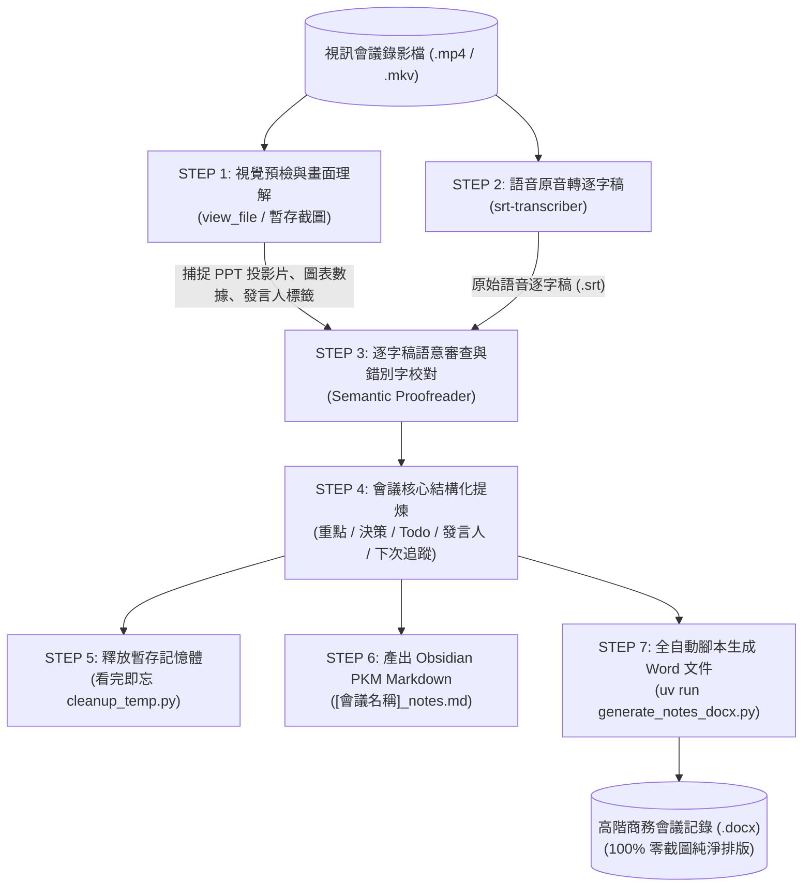

# 將視訊會議錄影轉換為高階會議記錄工作流程

本技能提供將視訊會議影音檔轉換為結構化、高階商務會議記錄 Word (`.docx`) 與 Obsidian Markdown (`.md`) 的全自動工作流程。核心特色為：**視覺輔助理解簡報圖表、ASR 逐字稿語意校對（修正同音錯別字）、發言人辨識標記、下次會議追蹤項目 Highlight**，並透過**全自動腳本排版生成 100% 零截圖純淨文件**。

## 流程參數宣告 (Parameters - YAML 屬性)

產出之會議記錄 Markdown 文件開頭 **MUST** 宣告標準 YAML frontmatter 屬性（遵循 Obsidian PKM 格式）：

```yaml
---
title : {{title}}
description : 
date : {{date}} {{time}}
aliases : []
status: unread
tags : 
- Type/📝/✨
Topics : 
---
```

> [!IMPORTANT]
> **影片來源放置規則**：
> 原始視訊會議錄影檔案來源 **MUST NOT** 寫入開頭 YAML parameters 中，**MUST** 統一置於會議記錄 Markdown 文件的最末端 `# 參考資料` 章節，格式如下：
> ```markdown
> # 參考資料
> - [影片相對路徑/檔名.mp4]
> ```

---

## 關鍵流程與工具管線架構 (Pipeline Architecture)



---

## 核心步驟規範 (Steps - RFC2119 Protocol)

執行端（Agent）**MUST** 嚴格遵循以下步驟順序執行，並遵守 RFC2119 規範強度：

### STEP 1: 畫面預檢與視覺認知輔助 (理解 PPT 簡報與數據)
1. Agent **MUST** 檢視視訊會議畫面（透過 `view_file` 預檢或暫存截圖）。
2. Agent **MUST** 專注提取視覺資訊：投影片標題、圖表數據、白板架構圖、展示畫面重點以及視訊鏡頭上的與會者姓名標籤。
3. **零截圖原則 (Crucial)**：此階段截圖僅作為 Agent 理解會議內容之輸入認知輔助，產出之 Markdown 與 Word 文件 **MUST NOT** 插入任何會議截圖。

### STEP 2: 語音原音轉逐字稿
1. Agent **MUST** 調用 `srt-transcriber`（或適用於台語/中文的 `srt-transcriber-zh`）將會議音訊轉換為帶有時間戳記之原始逐字稿 (`.srt`)：
   ```bash
   uv run .agent/skills/srt-transcriber/scripts/transcribe.py path/to/meeting.mp4
   ```
2. 若已具備文字逐字稿，**MAY** 直接略過此步驟以節省算力。

### STEP 3: 逐字稿語意審查與錯別字校對 (Semantic Proofreading)
1. 針對 STEP 2 產出之原始 ASR 逐字稿，Agent **MUST** 進行全面的語意審查 (Review)。
2. Agent **MUST** 對照 STEP 1 獲取之 PPT 簡報文字與專案術語，修正同音異字（如將「導流版工差」校正為「導流板公差」、「換膜」校正為「換模」）。
3. Agent **SHOULD** 去除語音冗贅詞（如「那個」、「然後」），將口語轉化為精確通順之書面商務語句。

### STEP 4: 結構化會議核心提煉與發言人標記
Agent **MUST** 將會議記錄提煉為以下核心維度，並遵循 `asset/meeting_notes_template.md` 範本：
- **會議基本資訊**：會議時間、地點/線上連線、主席、記錄人、出列席名單。
- **會議核心摘要 (Highlights)**：3 ~ 5 點高階成果結論。
- **關鍵決策事項 (Decisions Made)**：編號、決策主題、決策共識內容、負責人、生效日期。
- **待辦事項清單 (Action Items / Todo List)**：任務內容、負責人 (Owner)、截止期限 (Due Date)、當前狀態。
- **各議題討論紀要 (Agenda & Discussions)**：若可辨識發言者（經由自我介紹、主席點名或簡報作者），**SHOULD** 明確標註發言人姓名與職稱（格式如 `【張處長】`、`【李工程師】`）；無法確認者則標註討論角色（如 `【研發代表】`）。
- **下次會議追蹤項目 (Next Meeting Follow-ups)**：**MUST** 設置專屬區塊，收錄下次開會開場時之重點 Highlight 檢核項目與預計報告人。
- **參考資料**：**MUST** 於最末端包含 `# 參考資料` 並附上影片相對路徑。

### STEP 5: 釋放影音暫存記憶體 (看完即忘)
1. 完成結構化 Markdown 寫入後，Agent **MUST** 執行清理腳本釋放暫存：
   ```bash
   uv run .agent/skills/video-to-notes/scripts/cleanup_temp.py --conversation-id <當前對話ID>
   ```
2. Agent **MUST NOT** 在後續作業再次讀取原始大檔案影片，後續所有作業 **MUST** 100% 依賴產出之 Markdown 文件。

### STEP 6: 產出結構化 Markdown 筆記
1. Agent **MUST** 將所有結構化會議內容輸出為 `[會議名稱]_notes.md`。
2. 檔案格式 **MUST** 嚴格相容 Obsidian PKM frontmatter 規格。

### STEP 7: 全自動腳本生成 Word 會議記錄 (禁止手寫臨時程式碼)
1. Agent **MUST NOT** 手寫臨時程式碼或手動編輯排版。
2. Agent **MUST** 調用本技能提供之標準腳本 `generate_notes_docx.py`：
   ```bash
   uv run .agent/skills/video-to-notes/scripts/generate_notes_docx.py \
     --input path/to/[會議名稱]_notes.md \
     --output path/to/[會議名稱].docx
   ```
3. 腳本內部自動保證：
   - **字體規範**：中文字型強制 `Noto Sans TC`，英文字型 `Calibri`。
   - **階層字級**：H1 (26pt 置中深藍), H2 (18pt 次標藍), H3 (14pt), 內文 (10.5~12pt)。
   - **商務表格**：標題列深藍色背景、交替列淺灰紋、Todo 待辦具備核取方塊符號 `☐`、下次會議追蹤項目專屬強調。
   - **零截圖保證 (Zero-screenshot)**：產出之 Word 文件絕無圖片嵌入，維持高階專業商務純文字排版。

---

## 異常與邊界處置 (Error Handling - RFC2119)

針對可能發生之異常狀況，Agent **MUST** 嚴格執行以下應變處置：

| 邊界狀況 (Edge Case) | 觸發條件 (Criteria) | 對應處置行動 (Action) |
|---|---|---|
| **Edge Case 1: 音訊雜音嘈雜或多人同時重疊發言** | `srt-transcriber` 輸出片段包含亂碼、重複單字或標註 `[音樂/背景音]`。 | Agent **MUST NOT** 盲目猜測；**MUST** 結合 STEP 1 捕捉之 PPT 投影片要點進行上下文對照還原；若仍有歧義，**SHOULD** 於該議題小節標註「發言內容因多人重疊語意未明，記錄為共識摘要」。 |
| **Edge Case 2: 投影片字體模糊或無簡報畫面 (純語音視訊)** | 視訊錄影解析度過低（如 360p）導致畫面文字無法辨讀，或會議為純人臉通話。 | Agent **MUST** 切換至「純語音理解審查模式」；**MUST** 於產出的 Markdown 文件中註明「本會議採純語音理解分析」，並透過前後文語意上下文執行錯別字校正。 |
| **Edge Case 3: 溝通型會議未形成具體決策或無 Todo** | 該會議為日常狀況同步或臨時閒聊會，會中無任何表決或行動指派。 | 腳本 **MUST NOT** 崩潰報錯；`generate_notes_docx.py` **MUST** 在決策與 Todo 區塊優雅提示「本會議為資訊同步會議，無新增表決決策與待辦追蹤項目」。 |
| **Edge Case 4: 輸出 Word 文件時發生檔案鎖定 (PermissionError)** | 使用者在 Microsoft Word 中開啟該 `output.docx` 導致寫入衝突。 | 腳本 **MUST** 捕捉異常，自動加上當前時間戳後綴（如 `[會議名稱]_20260914_1530.docx`）完成安全備份輸出，**MUST NOT** 導致整體任務中斷。 |

---

## 參考資源與規範文件

- 會議範本檔案：[`asset/meeting_notes_template.md`](asset/meeting_notes_template.md)
- 工具說明手冊：[`README.md`](README.md)
- 會議資安政策：[`sec.md`](sec.md)
- 影片來源宣告規範：產出之會議記錄最末端 **MUST** 包含 `# 參考資料` 章節並標註影片來源（如 `- [影片相對路徑/檔名.mp4]`）。
